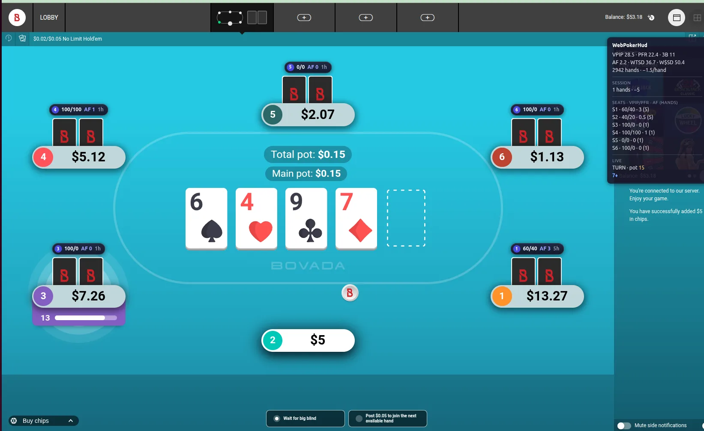

# WebPokerHud

**A live poker HUD that runs in your browser.** Session stats over every
seat, every hand you play saved locally, and real analysis of your own
game — free, open source, nothing to install on your OS.

[](https://addons.mozilla.org/firefox/addon/webpokerhud/)
[](https://addons.mozilla.org/firefox/addon/webpokerhud/)
[](LICENSE)
[](https://github.com/wildfeds/webpokerhud_public/actions/workflows/website.yml)



Website: **[webpokerhud.com](https://webpokerhud.com)** · Docs:
[install](https://webpokerhud.com/docs/install/) ·
[quickstart](https://webpokerhud.com/docs/quickstart/) ·
[stats glossary](https://webpokerhud.com/docs/stats/) ·
[data format](https://webpokerhud.com/docs/data-format/)

## Install

- **Firefox (recommended)** — one click on
  [Firefox Add-ons](https://addons.mozilla.org/firefox/addon/webpokerhud/).
  Firefox 128 or newer; updates are automatic.
- **Chrome** — manual install (the Chrome Web Store does not list tools
  that run on poker sites): download `webpokerhud-chrome-<version>.zip`
  from the [latest release](https://github.com/wildfeds/webpokerhud_public/releases/latest),
  unzip it to a folder you'll keep, open `chrome://extensions`, turn on
  **Developer mode**, click **Load unpacked** and pick the folder.
  Full steps: [install guide](https://webpokerhud.com/docs/install/).

Then open a cash table — the HUD attaches by itself.

## What it does

- **Live HUD** on the table: VPIP / PFR / 3-bet / aggression for every
  occupied seat, updating as hands are played; your own chip shows the
  image you're giving off.
- **Automatic hand tracking** — every completed hand is stored in your
  browser (IndexedDB). No importing, no waiting for the site's delayed
  hand histories.
- **Popup** — your core stats and a net-winnings graph, filtered by time
  range and stake level.
- **Analysis panel** — overview with leak highlights and an all-in-EV
  line, a hand browser with street-by-street replays and line filters,
  one-click JSONL export and batch import. The data format is
  [documented](https://webpokerhud.com/docs/data-format/) — your hands are
  yours.
- **Pro (optional, prepaid)** — server-side position stats, starting-hand
  matrix, session tracking and trend charts. The free tier needs no
  account and never talks to a server.

### What it deliberately doesn't do

- No cross-session opponent tracking: on anonymous tables players are
  identified per session, so opponent reads reset when you change tables.
  Your own stats persist forever.
- No automation, no advice during the hand, no hole-card information
  beyond what the table shows you.

### Supported in v1.0

Bovada cash games, No-Limit Hold'em, 6-max tables, multi-tabling. 9-max
tables, Zone poker and tournaments are tracked but not fully supported
yet — the [roadmap](https://webpokerhud.com) lists what ships next.

## Privacy

Hands are stored in your browser and statistics are computed locally.
Nothing leaves your machine unless you open the analysis panel (hands are
then sent to our API, processed in memory, never stored) or sign in for
Pro. No ads, no trackers. Policy: [webpokerhud.com/privacy](https://webpokerhud.com/privacy).

## How it works

A content script running in the page's main world hooks `WebSocket` and,
for the game-events socket only, forwards each JSON event to the
extension's isolated world, where a connector rebuilds the hand state and
emits completed hands. The overlay anchors stat chips to the table's seat
elements. Everything the HUD shows is derived from data the site already
sends to your own browser. Details: [docs/design.md](docs/design.md).

## Build from source

Node.js 22 and npm.

```sh
npm ci
cp .env.example .env          # Supabase URL + public anon key (only needed for sign-in)
npm run build:firefox         # → dist-firefox/
npm run build                 # → dist/ (Chrome)
npm test                      # unit suite
npm run run:firefox           # launch Firefox with the extension, live reload
npm run lint:firefox          # web-ext lint on the Firefox build
```

Load `dist-firefox/manifest.json` as a temporary add-on at
`about:debugging`, or `dist/` via "Load unpacked" in Chrome. Store
packages (`npm run package:firefox:verify`, `npm run package:chrome-sideload`)
are reproducible — see [docs/RELEASING.md](docs/RELEASING.md).

### Layout

| Path | What |
|------|------|
| `manifest.json` | One template; `{{chrome}}.`/`{{firefox}}.` key prefixes resolve per target |
| `src/injected.ts` | Main-world WebSocket tap |
| `src/content_script.ts`, `src/connector/` | Game events → hand state machine |
| `src/overlay/` | On-table HUD panel and seat chips |
| `src/popup/`, `src/panel/` | Toolbar popup and the analysis panel |
| `src/storage/`, `src/analysis/` | IndexedDB hand store, statistics |
| `src/ui/html.ts` | Escape-by-default templating (no `innerHTML`) |
| `website/` | webpokerhud.com (Next.js, static export) |
| `docs/` | Design notes, bug journal, release checklist |

## Contributing

Bug reports and pull requests are welcome — see
[CONTRIBUTING.md](CONTRIBUTING.md). For a bug, the
[issue template](https://github.com/wildfeds/webpokerhud_public/issues/new/choose)
asks for the few things that make it reproducible.

## License and disclaimer

MIT — see [LICENSE](LICENSE).

WebPokerHud is not affiliated with Bovada or any poker platform. Poker
sites have their own rules about tracking tools; check the terms of the
site you play on before using any third-party software.
